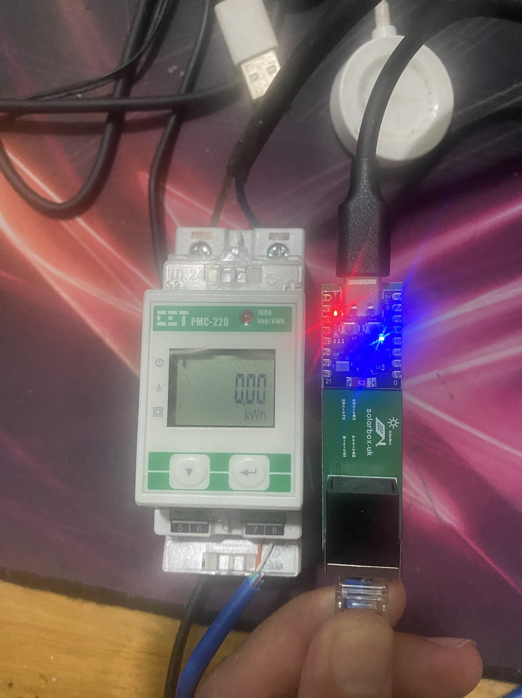
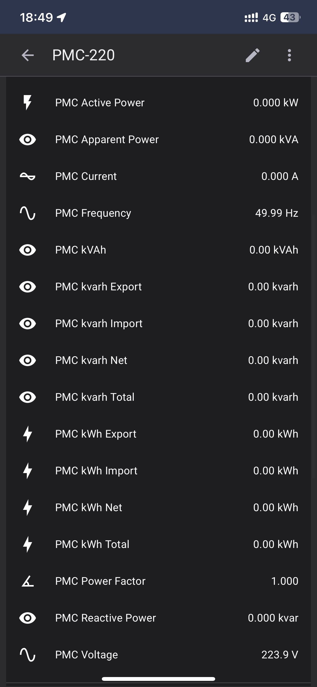

# Mang thông tin PMC220 lên HA theo dõi điện năng 2 chiều
## 1. Kết nối phần cứng

```
               RS485                        UART
┌─────────┐              ┌─────────────┐           ┌─────────────────┐
│         │              │          GND│<--------->│GND              │
│ PMC220 8│<-----B- ---->│  RS485   RXD│<--------->│RX    ESP32/     │
│        7│<---- A+ ---->│  to TTL  TXD│<--------->│TX    ESP8266    │
│         │              │  module  VCC│<--------->│3.3V          VCC│<--
│         │              │             │           │              GND│<--
└─────────┘              └─────────────┘           └─────────────────┘
```



## 2. Nạp firmware

```bash
# Install esphome
pip3 install esphome

# Clone this external component
git clone https://github.com/TThanhXuan/PMC220_2ha.git
cd PMC220_2ha

# Create a secrets.yaml containing some setup specific secrets
cat > secrets.yaml <<EOF
wifi_ssid: MY_WIFI_SSID
wifi_password: MY_WIFI_PASSWORD

EOF

# Validate the configuration, create a binary, upload it, and start logs
esphome run dev_pmc220.yaml

```

## 3. Thành quả

